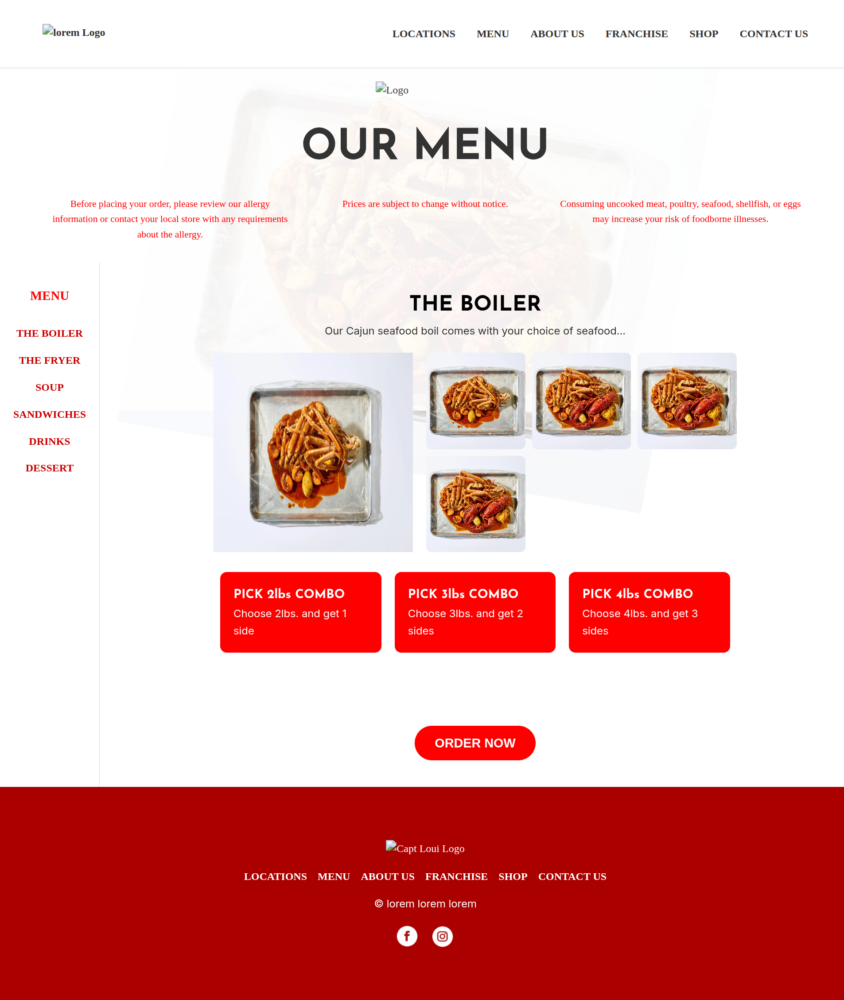
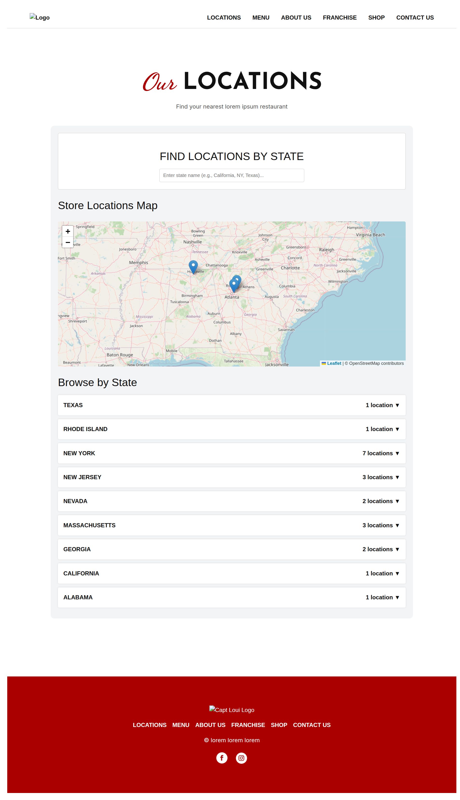
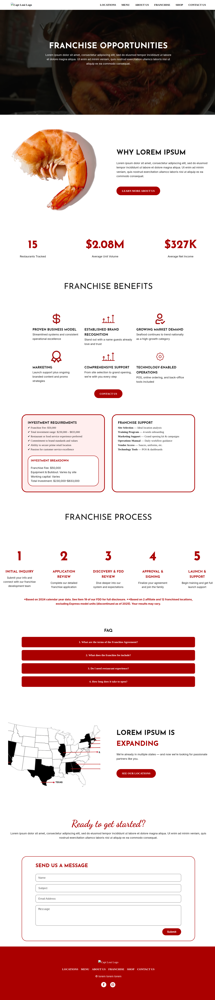
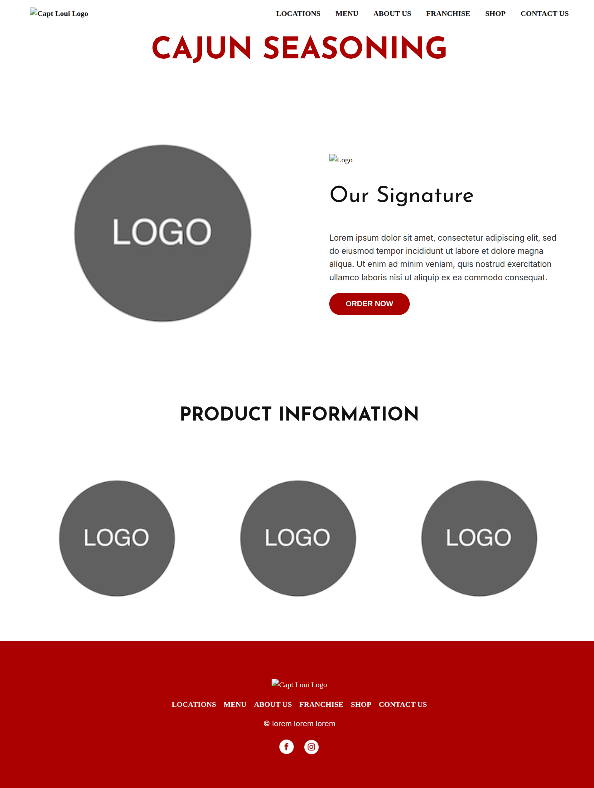
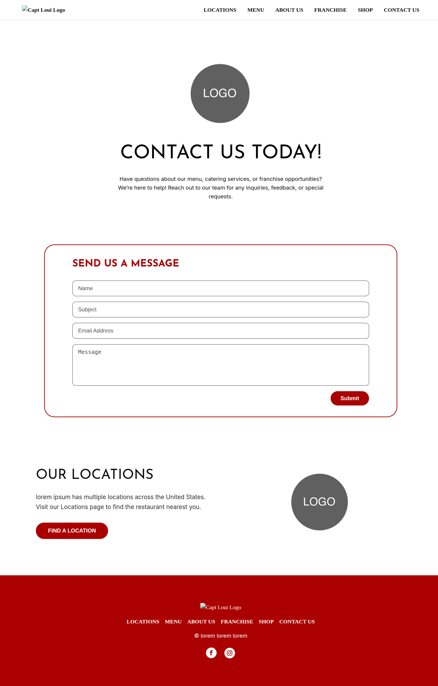

# Static Wordpress Clone – HTML/CSS/JS

This project is a **fully static clone** of a WordPress-based restaurant website. It was built using **HTML5, CSS3, and vanilla JavaScript** with no frameworks.

## 📖 The Story

A week before publishing this, I was hired for a freelance project with a simple brief:

> “Make an exact copy of this WordPress website in pure HTML, CSS, and JS. You won’t get backend access — just the link.”

The client paid only $10 upfront for the "get started" phase and then ghosted me once the build was done.

While I never handed over the full code, I was asked to upload it to Cloudflare — where I suspect it was copied using dev tools.

Since the code was never officially delivered and has just been sitting on my machine — I've decided to put it to good use (with all proprietary content and branding removed) as a portfolio project.

## 🔧 Tech Stack

- **HTML5** – Semantically structured and responsive
- **CSS3** – Clean layout, flex/grid-based, mobile-friendly
- **JavaScript (vanilla)** – For interaction and minor dynamic behavior
- **Leaflet.js** – (Used in the location page for map rendering)

## ✨ What This Project Demonstrates

- **Recreating complex Website layouts statically**
- Clean, accessible, and responsive **frontend structure**
- Efficient, maintainable code without unnecessary libraries
- Page-by-page breakdown of a real-world business site

## 📸 Screenshots

| Home Page | Menu Section | Location Map | Franchise | Shop | Story | Contact |
|-----------|--------------|--------------|-----------|------|-------|---------|
|  |  |  |  |  |  | |

> **Note:** All original branding, text, and logos have been replaced with placeholder content (`lorem ipsum`, dummy images, etc.) to keep this legal and respectful.

## 👨‍💻 About Me

I primarily build full-stack applications using **Next.js** and **Go**, but this is an example of me using just html to design and code responsive static websites from scratch.

Want to build something together? [let’s connect](mailto:fortrash2069@gmail.com)!

---

## 📝 License

This repo is shared for educational and portfolio purposes only. Do not use this codebase to recreate the original business or impersonate a real brand.

---
